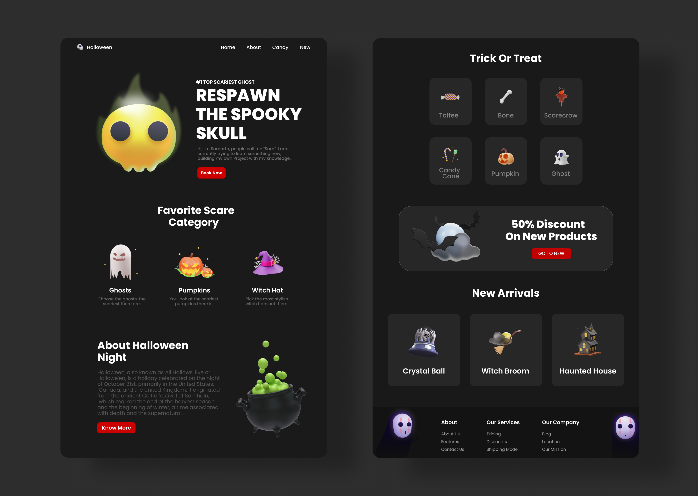

# Halloween Website :jack_o_lantern:


- Responsive Halloween Website Using HTML, CSS, and JavaScript
- It has the best color contrast.
- Smooth scrolling in each section
- Developed desktop screens and mobile screens as well.
- Compatible with all mobile devices.
- A Beautiful and simple user interface.

<br>

## :camera_flash: Screenshots



<br>

## Tech Stack

- This Project is Build With Some Famous Tech And Tools Which Are Mentioned Below... :point_down: <br><br>

[](https://skillicons.dev) <br><br><br>


## Run Locally


- Open any code Editor you can work with and open a Terminal in that editor.

<br>


Go to the project directory :

```bash
  cd my-project
```

<br>


Clone the project :

```bash
  git clone https://github.com/YOUR-USERNAME/YOUR-REPOSITORY
```
<br>

: ) After creating the clone, you are free to modify the code as you see fit.

```bash
$ git clone https://github.com/YOUR-USERNAME/YOUR-REPOSITORY
> Cloning into `my-project`...
> remote: Counting objects: 10, done.
> remote: Compressing objects: 100% (8/8), done.
> remove: Total 10 (delta 1), reused 10 (delta 1)
> Unpacking objects: 100% (10/10), done.

```

<br><br>

## :rocket: Live Demonstraion

- [Preview Calculator](https://samarthdadhaniya.github.io/single-page-website/)


<br><br>

## 🔗 Connect With Me
[](https://www.linkedin.com/in/samarth-dadhaniya/)
[](https://github.com/samarthdadhaniya)
[](https://www.instagram.com/)
[](https://www.twitter.com/)

<br><br>

## :technologist: Devloper

- [@ Samarth Dadhaniya](https://github.com/samarthdadhaniya/)

